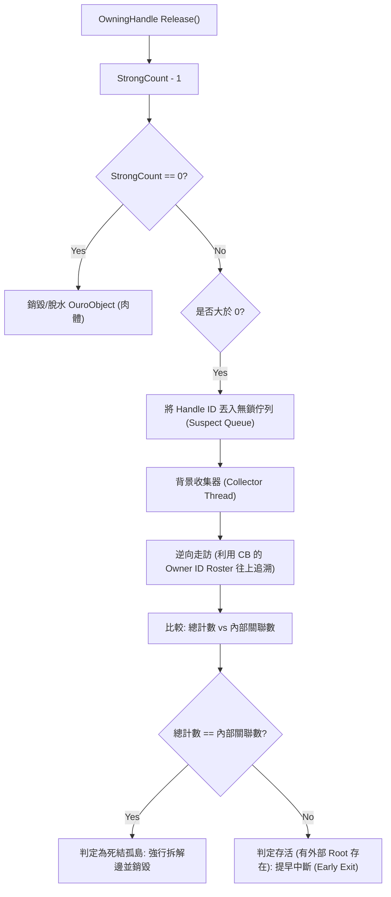

# OuroKore (奧核) 概念程式庫架構整理

根據您的 NotebookLM 筆記「OuroKore 程式庫建立」中最新追加與調整的設計細節（特別是關於 **Owner ID Roster**、**Lazy Pruning 的 C++ const 解決方案**，以及**非同步逆向搜尋演算法**），我已整理了這份架構總結報告。

這份整理將作為我們後續編寫程式碼的最高指導方針。

---

## 1. 核心願景與三大目標

OuroKore 是一個以 C++ 為核心開發的底層概念程式庫，但具備「去語言化 (Language-agnostic)」的特性，旨在提供：
*   **安全共享 (Safe Sharing)**：跨語言、跨執行緒的絕對記憶體安全，揚棄外部對原始指標的直接存取。
*   **永續儲存 (Persistence)**：物件生命週期可超越單次執行期，支援將物件狀態持久化儲存。
*   **物件再生 (Regeneration)**：
    *   **微觀休眠 (記憶體優化)**：系統因應記憶體壓力自動觸發的「脫水 / 補水」機制（控制區塊與其 Handle ID 常駐於記憶體中）。
    *   **宏觀生死 (真復活與傳輸)**：跨越時間（進程關閉重啟、角色下線再上線）與跨空間（跨網路端點、跨進程設備傳輸）的物件實體狀態完美復原與克隆。

---

## 2. 雙核記憶體管理模型 (靈肉分離)

所有物件的生命週期與資料被嚴格拆分為「靈魂（控制區塊）」與「肉體（物件實體）」：

### A. 控制區塊 (Control Block - 靈魂)
*   **職責**：生命週期的中樞管理，即使肉體被銷毀，控制區塊（墓碑）也會在有弱引用時保留。
*   **核心成員**：
    *   `m_strong_count` (強引用計數)：決定 **OuroObject (肉體)** 的生死。當其歸零時，`m_payload` 會被 `delete` 並置為 `nullptr`（即立碑狀態）。
    *   `m_weak_count` (弱引用計數)：決定 **Control Block** 本身的存亡。當強、弱計數皆為 0 時，此控制區塊才會被銷毀。
    *   `m_rw_lock` (底層讀寫鎖)：保護 `m_payload` 的讀寫安全與補水安全。
    *   `m_payload` (指向實體物件的原始指標)：指向繼承自 `OuroObject` 的具體子物件。
    *   `m_owners` (**Owner ID Roster / 擁有者名冊**)：維護一個動態列表（例如 `std::vector<HandleID>`），精準記錄目前有哪些 `OwningHandle` 指向自己。這取代了傳統正向垃圾回收的順向搜尋，為「逆向搜尋」提供了基礎數據。

### B. 基礎物件基底 (OuroObject - 肉體)
*   **職責**：所有實際資料 (Payload) 的擴充基底，提供 RTTI 與具體的序列化合約。
*   **核心功能**：
    *   **強制 RTTI**：要求自訂元件強制實作 `virtual uint64_t GetTypeID() const = 0;`。
    *   **解構安全**：強制實作 `virtual ~OuroObject() = default;`。
    *   **序列化合約**：定義虛擬函式將物件狀態序列化為 Byte Stream，用於脫水/補水。
    *   **防範多重/菱形繼承**：在全域工廠端（`ork::CreateObject<T>()`）使用編譯期檢查 `static_assert`（如 `std::is_convertible_v<T*, OuroObject*>`），在編譯時期徹底封殺菱形繼承。

---

## 3. 跨時空復活與傳輸機制

為了實現「真復活（如角色下線後重啟復活）」與「跨空間克隆（如物件傳輸給他人）」， OuroKore 規範了以下三大機制：

### A. 二進位狀態圖譜 (State Blueprint)
物件經由 `OuroObject::Serialize()` 產出的二進位流必須為自解釋格式：
1.  `Type_ID` (uint64_t) : 物件的 RTTI 型別識別碼。
2.  `Payload_Size` (uint64_t) : 業務資料位元組長度。
3.  `Payload_Data` (Byte[]) : 屬性與資料狀態。
4.  `Edge_Count` (uint32_t) : 向外指向其他物件的連線數量。
5.  `Edge_Roster` (Edge_Entry[]) : 拓撲關係名冊（使用**相對符號連結**，嚴禁包含本機記憶體指標或當次 Handle ID）。

### B. 跨空間再生 (3D 生物列印)
將藍圖傳遞給另一個獨立的 OuroKore 實體時的重建合約：
1.  解析 `Type_ID`，透過 `ork::CreateObject(Type_ID)` 在堆積中動態配置 C++ 肉體。
2.  本地中樞核發該端點專屬的全新局部 `Handle ID`。
3.  將 `Payload_Data` 注入新配置的物件中，並根據 `Edge_Roster` 在新記憶體空間中完全重建拓撲關係。

### C. 跨時間復活：雙軌識別元模型 (Dual-Identifier Model)
*   `Handle ID` (內部)：64-bit 隨機整數，專供內部 $O(1)$ 高速存取使用，程式重啟即失效。
*   `Persistent ID` (外部/外掛)：字串型態的永久唯一識別元（如 `Player_UUID_9527`），永久跨越重啟。
*   **冷啟動復活流程**：
    1. 外部請求 `Persistent ID`。
    2. 記憶體映射表未命中（撞到冷墓碑）。
    3. I/O 儲存層尋找本機 `PersistentID.blueprint` 檔案。
    4. 讀取並動態重建該物件，核發新的本機 `Handle ID`。
    5. 將新 `Handle ID` 與 `Persistent ID` 重新綁定回 Registry 並回傳。

---

## 4. 使用端指標武器庫 (ork 命名空間)

為了解決傳統 C++ 與其他高階語言在記憶體管理上的複雜性，並實現「使用者無腦自由連結」，我們定義了三種指標類型：

| 指標類型 (ork::) | 影響的計數器 | 職責與特性 | 使用場景 |
| :--- | :---: | :--- | :--- |
| **OwningHandle** | `StrongCount` | 強引用連結器。建立時會向目標的 Control Block 註冊自己的 ID 進入其 `Owner ID Roster`；銷毀時註銷，並扣減強引用計數。 | 長期持有物件、變數宣告 |
| **WeakHandle** | `WeakCount` | 觀察者登記指標。不參與生死計數，僅用來「撐住 Control Block 墓碑」。 **[新增] 懶惰修剪 (Lazy Pruning)**：探測目標時若發現強引用已歸零，會將內部儲存 `m_id` 清空（設為 0），並觸發 `ReleaseWeak` 扣減弱計數，讓墓碑提早消亡。 | 觀察者模式、快取系統、墓碑探測 |
| **OuroPtr** | 無 | 單純包裹的執行指標。無計數增減，透過 RAII 概念在建立時鎖住 Mutex，銷毀時解鎖，提供 `->` 運算子操作 Target。 | 函式參數傳遞、短暫唯讀或寫入操作 |

> [!TIP]
> **Lazy Pruning C++ const-correctness 實作策略**  
> 由於 `WeakHandle::IsAlive()` 通常宣告為 `const`，但在「懶惰修剪」中需要清空內部的 `m_id`，這打破了 `const` 承諾。  
> 解決方案如下：
> 1.  將 `WeakHandle` 的成員變數 `m_id` 宣告為 **`mutable`**，允許在 `const` 函式中對其修改。
> 2.  或者直接**移除 `IsAlive()` 的 `const` 修飾**，明示該呼叫可能會改變指標的內部狀態。

---

## 5. 逆向循環參照收集機制 (Cycle Collector)

為了擺設 C++ 弱指標的限制，並讓使用者自由建立循環關係，我們採用非同步循環收集：

*   **為什麼逆向搜尋更安全？**  
    在多執行緒環境下，正向搜尋（Bacon-Rajan 演算法）極易遇到 **移動靶陷阱 (Moving Target)**，需要繁重的讀寫屏障（Read/Write Barriers）來防止主執行緒在搜尋時修改連線，否則會因狀態不一致導致誤判並崩潰。  
    **逆向搜尋 (Upstream Search)** 從嫌疑犯出發，沿著 `Owner ID Roster` 往上追溯，只要能摸到代表 C++ 堆疊或外部變數的根節點（如 `ORK_ROOT_ID` 或 `0`），即可 100% 確保其存活並提早中斷。若所有路徑皆形成沒有外部根的封閉迴圈，則斷定為死結孤島，由收集器直接強制拆解邊緣。

---

## 6. 目錄架構規劃

本專案將採以下結構部署：
*   `specs/`：存放此規格書。
*   `core/include/`：
    *   `ourokore/c_api/`：給應用開發者的 C 接口（`core.h` 安全沙盒與 `component_api.h` 靈肉橋樑）。
    *   `ourokore/component/`：給 C++ 元件開發者的接口 (`OuroObject.hpp`, `Handles.hpp`)。
*   `core/src/`：私有的核心 C++ 實作。

---

## 7. NotebookLM 最新 Code Review 改善與修復建議

針對目前專案實作，NotebookLM 提供了以下關鍵修復與優化建議：

### A. Registry 與併發邊界修復
1. **`Registry` 解構邊界 ( Use-After-Free 防護 )**：
   - 在 `UnregisterEdge` 與 `UnregisterWeak` 清除死物件時，必須先從 `m_object_map` 中執行 `erase(it)` 取得獨佔所有權，然後再執行 `delete cb`，避免其他執行緒透過 Read Lock 取得存取中的 ControlBlock 指標。
2. **`AcquireObjectPointer` 空指標與多執行緒防護**：
   - 在讀取 `cb->m_payload` 時，即便檢查 `m_strong_count > 0`，也需搭配讀取鎖或 shared lock，防止肉體在另一執行緒剛好被 `delete`。

### B. Handles 指標武器庫與 Move 語意修正
1. **`OwningHandle` 移動語意 (Move Semantics)**：
   - 移動建構子與移動賦值運算子 (`operator=`) 轉移所有權時，只需將來源的 `m_target_id` 置為 `0`，**絕不可呼叫 `other.Release()`**。呼叫 `other.Release()` 會向底層觸發 `ork_unregister_edge`，導致剛轉移的 Edge 計數被意外扣減。
2. **`OuroPtr` 解引用生命週期防禦**：
   - `OuroPtr` 為 RAII Lock Guard，使用者不可將解引用拿到的 `T&` 或原始指標傳遞至超越 `OuroPtr` 作用域外使用。

### C. C ABI 標頭檔「黃金雙層分流」規範
1. **`c_api/core.h`（外部應用安全沙盒）**：
   - 僅暴露 Handle ID (`uint64_t`) 與純 C 狀態碼，絕不暴露 C++ 原始指標或底層 Mutex。適合 Node.js / Python 等 FFI 綁定。
2. **`c_api/component_api.h`（靈肉橋樑）**：
   - 放置 `bind_payload`、`acquire_object_pointer` 及底層 RWLock 介面，供 C++ 元件與 `Handles.hpp` 內部呼叫。
3. **廢除 `internal_api.h` 與 C ABI 匿名工廠**：
   - 揚棄 C ABI 級別的 `ork_create_object_by_type`，物件建立完全由 C++ 原生 `ork::CreateObject<T>()` 樣板負責。

